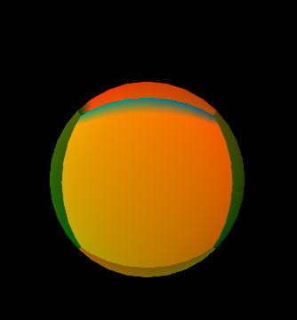
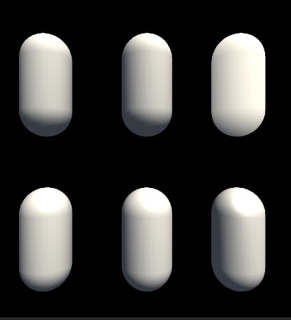
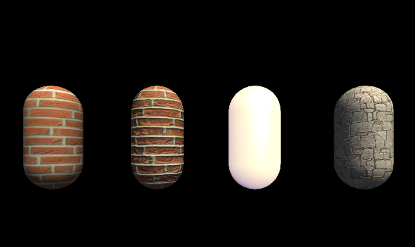
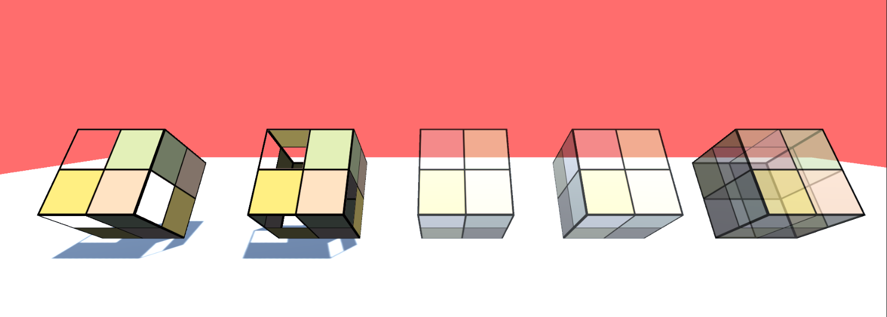
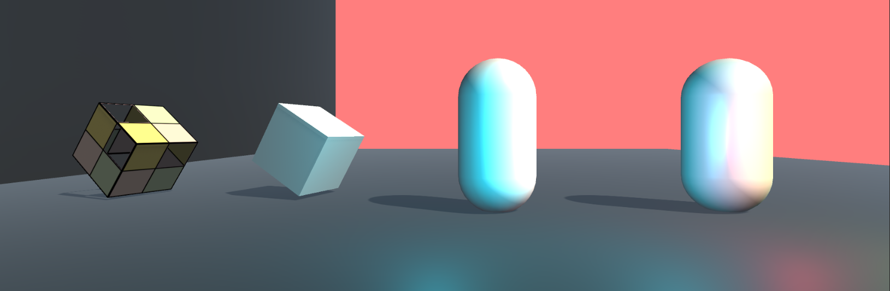
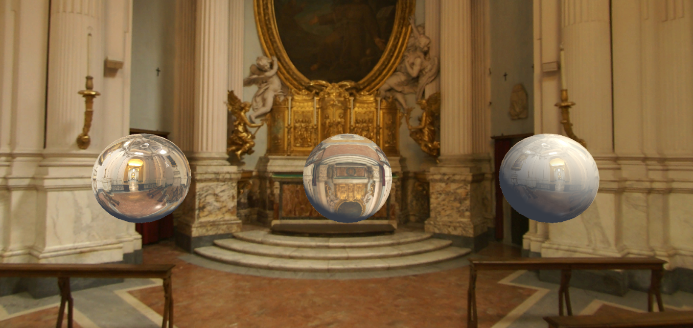
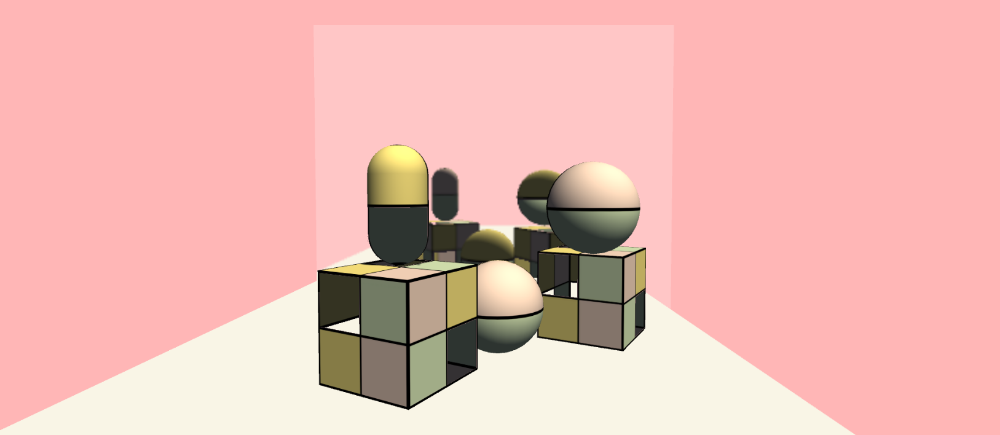

# Unity shader effect reproduction
*In this repository, I reproduced the code in "Unity Shader Essentials" and added detailed comments to the shader code in the code block. I tried to make the scene as simple as possible. If necessary, you can download it and open it with Unity.*

## Display

###  VertexVisualizer

### Basic Lighting

### Base Texture

### Alpha

### Complex lighting

### Advanced Textures

